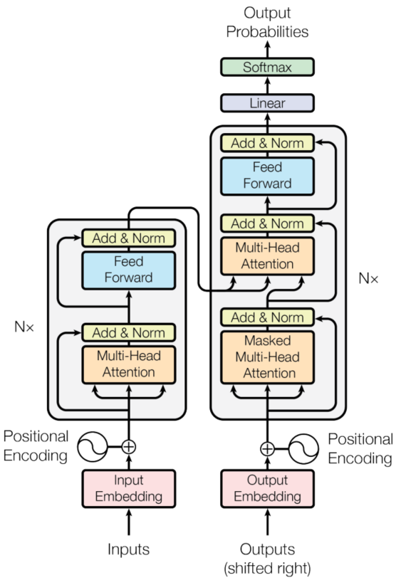

	

  

## RoadMap-to-A-Llmer
### Papers
| Year | Paper | Project | Code | Notes |
| :----: | :----: | :----: | :----: | :----: |
| 2017.06 | [Attention Is All You Need](https://arxiv.org/pdf/1706.03762.pdf) | None | [Code](Attention_is_All_You_Need/attention_is_All_You_Need.py) | [Transformer](Attention_is_All_You_Need/attention-is-all-you-need.md) |
| 2018.06 | [Improving Language Understanding   by Generative Pre-Training](https://s3-us-west-2.amazonaws.com/openai-assets/research-covers/language-unsupervised/language_understanding_paper.pdf) | None | **TODO** | **TODO** |

### References
[machine-learning-notes](https://github.com/luweiagi/machine-learning-notes)  
[pytorch-seq2seq](https://github.com/bentrevett/pytorch-seq2seq)  
[Awesome-LLM](https://github.com/Hannibal046/Awesome-LLM)
